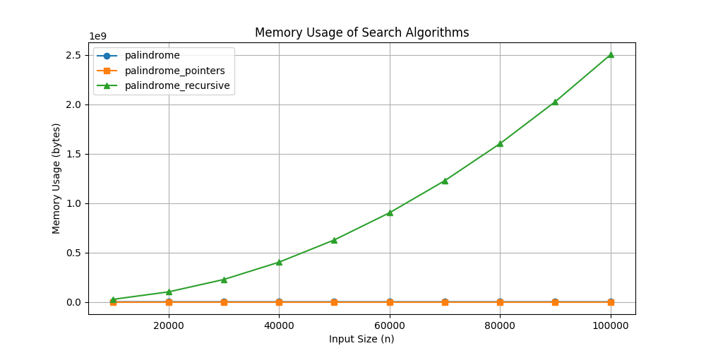
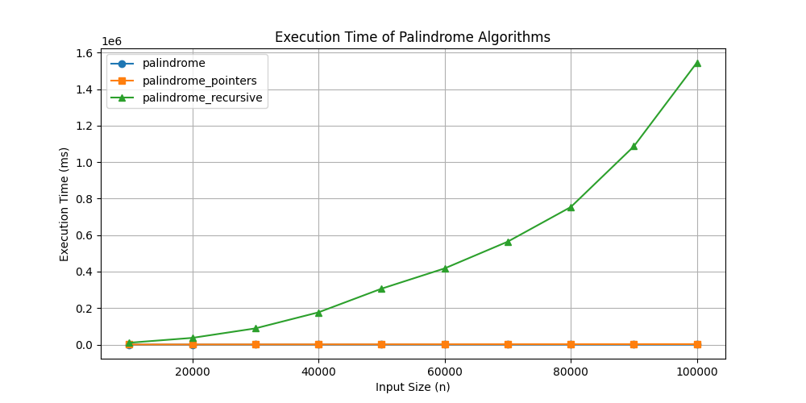

## Palindrome Checking Algorithms
### Introduction
Palindrome checking is a fundamental problem in string processing, used in various applications such as text processing, DNA sequence analysis, and data validation. A palindrome is a string that reads the same forward and backward. This document explores three different methods to check for palindromes: using slicing, two-pointer technique, and recursion.
### 1. Palindrome Check using Slicing
#### Description
This method leverages Python’s slicing feature to reverse the string and compare it with the original.
#### Algorithm Steps
1. Reverse the string using slicing (`text[::-1]`).
2. Compare the reversed string with the original.
3. If they match, return `True`; otherwise, return `False`.
### 2. Palindrome Check using Two-Pointer Technique
#### Description
This method uses two pointers, one starting from the beginning and another from the end, moving towards the center while comparing characters.
#### Algorithm Steps
1. Initialize two pointers: `left` at the beginning and `right` at the end.
2. Compare the characters at `left` and `right` positions.
3. If they do not match, return `False`.
4. Move `left` forward and `right` backward.
5. Repeat until the pointers meet or cross.
6. If all comparisons pass, return `True`.
### 3. Palindrome Check using Recursion
#### Description
This method uses a recursive approach, checking if the first and last characters match while reducing the problem size.
#### Algorithm Steps
1. If the length of the string is 0 or 1, return `True` (base case).
2. Compare the first and last characters.
3. If they do not match, return `False`.
4. Recursively check the substring excluding the first and last characters.
### Complexities
### Complexities
| Algorithm                  | Best Case | Worst Case | Average Case |
|----------------------------|-----------|------------|--------------|
| Slicing Method             | O(n)      | O(n)       | O(n)         |
| Two-Pointer Technique      | O(1)      | O(n)       | O(n)         |
| Recursive Method           | O(1)      | O(n)       | O(n)         |
Each method has its advantages:
- **Slicing** is the simplest but creates an extra copy of the string.
- **Two-pointer** is memory-efficient and faster for large inputs.
- **Recursion** is elegant but may have performance issues with deep recursion.

Choosing the right method depends on the use case and performance requirements.
## Coverage

Make sure you have "coverage" in your requirements.txt file and run pip install. Then run `python -m coverage run -m unittest discover` and after that run `python -m coverage report` to get the following table:
```
Name                                  Stmts   Miss  Cover
---------------------------------------------------------
data\constants.py                         2      0   100%
data\data_generator.py                   12      0   100%
palindrome_algorithms\algorithms.py      16      0   100%
test\test_algorithms.py                  22      1    95%
test\test_data_generator.py              16      1    94%
---------------------------------------------------------
TOTAL                                    68      2    97%
If you want to see the lines that are not being used you can run 'python -m cover html' and then 'start htmlcov\index.html'
```

---
### Performance Comparison
| Size   | palindrome (Time, Mem) | palindrome_pointers (Time, Mem) | palindrome_recursive (Time, Mem) |
|--------|------------------------|---------------------------------|----------------------------------|
| 10000  | [0, 10049]             | [275, 96]                      | [9992, 25239951]                |
| 20000  | [0, 20049]             | [516, 96]                      | [36594, 100479951]              |
| 30000  | [1, 30049]             | [759, 96]                      | [88643, 225719951]              |
| 40000  | [1, 40049]             | [991, 96]                      | [176550, 400959951]             |
| 50000  | [1, 50049]             | [1242, 96]                     | [306364, 626199951]             |
| 60000  | [2, 60049]             | [1481, 96]                     | [417531, 901439951]             |
| 70000  | [2, 70049]             | [1772, 96]                     | [564113, 1226679951]            |
| 80000  | [3, 80049]             | [1976, 96]                     | [753881, 1601919951]            |
| 90000  | [4, 90049]             | [2207, 96]                     | [1086919, 2027159951]           |
| 100000 | [7, 100049]            | [2442, 96]                     | [1546309, 2502399951]           |

### Memory Usage


### Execution Time


